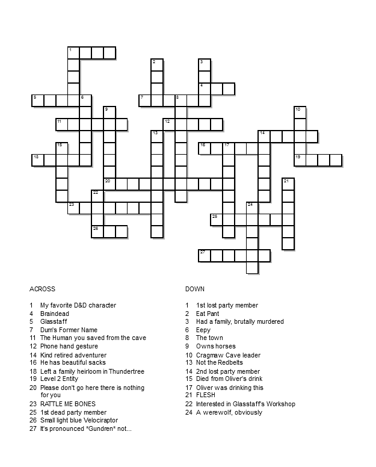

%6== >6 H92E x H2?E] !2:? DE@AD] #62= D:>A=6]
*@F 2C6 2 5:D8C246 E@ 2== 8@5DP
(92E 8@5Dn %96J 2C6 2== 5625[ :EVD ;FDE >6 2?5 J@F] %96C6 :D ?@ @?6 6=D6 E@ D2G6 J@F] }@H96C6 6=D6 7@C J@F E@ CF?]
q642FD6 J@F 56DEC@J65 :E 2==P
*@F E@@< 6G6CJE9:?8 7C@> >6P $@ x E9@F89E :E H@F=5 36 72:C :7 x E@@< 6G6CJE9:?8 7C@> J@F]
xV== ?6G6C 2?DH6C J@F]
(9Jn pC6 J@F D42C65 @7 E6==:?8 >6 E96 ECFE9n pC6 J@F D42C65 @7 E6==:?8 >6 H92E x 2=C625J <?@Hn
x ?6G6C H2?E65 E@ 5@ :E]
qFE J@F 5:5 5@ :E[ 2?5 96C6 H6 2C6 ?@H]
*@F 5:5?VE =:DE6?\
s@?VE J@F F?56CDE2?5n %96C6 H2D ?@ @?6 E@ =:DE6? E@P %96C6 H2D ?@ @?6 =67E 7@C >6[ ?@ @?6 E@ 8F:56 >6[ ?@ @?6 E@ 42C6 7@C >6[ 2?5 :EVD 2== J@FC 72F=E]
*@F 2C6 F?8C2E67F= 7@C H92E x 92G6 8:G6? J@FP
&?8C2E67F=n xV> E96 F?8C2E67F= @?6n *@F 3C@F89E 25G6?EFC6CD :?E@ E9:D H@C=5 2?5 232?5@?65 FD E96 >@>6?E H6 8@E DEC@?86C]]] *@F ?6G6C 42C65 23@FE >6 7C@> E96 368:??:?8[ 5:5 J@Fn xVG6 DA6?E 9F?5C65D @7 J62CD 5C62>:?8 @7 E9:D >@>6?E] xVG6 C6962CD65 6G6CJE9:?8 x 6G6C H2?E65 E@ D2J E@ J@F[ 6G6CJ H@C5[ E@ >2<6 J@F F?56CDE2?5 6I24E=J H92E J@F DE@=6 7C@> >6] qFE ?@H x C62=:K6]]] x 5@?VE ?665 J@F E@ F?56CDE2?5 2?JE9:?8] x 5@?VE ?665 J@F 2E 2==] x H:== E2<6 >J C:89E7F= A=246 :? E9:D F?:G6CD6[ 2?5 x H:== 5@ :E 72C 36EE6C E92? J@F 6G6C 4@F=5]

**Disclaimer:** Make sure to write down the solutions somewhere else in case you need to refresh the page.
{: .notice .notice--warning}

1\. The column number of each bulb from left to right, top to bottom i.e. (r1c2, r1c5, r2c3 = 253) [https://puzz.link/p?akari/7/9/o..agcgaj.j2.jbi.l11..cl](https://puzz.link/p?akari/7/9/o..agcgaj.j2.jbi.l11..cl){:target='_blank'}:
<input type="text" id="lights" name="lights" placeholder="Enter column numbers">

2\. Full chess notation of the solution (i.e. Qe4) [https://chesspuzzle.net/Puzzle/284336](https://chesspuzzle.net/Puzzle/284336){:target='_blank'}:
<input type="text" id="chessNotation" name="chessNotation" placeholder="Enter chess notation">

3\. Which line is the syntax error on in this python code?

def add(x,y):
print(x+y)
def subtract(x,y):
print(x-y)
def multiply(x,y)
print(x*y)
def divide(x,y):
print(x/y)

add(1,2)
subtract(1,2)
multiply(1,2)
divide(1,2)

<input type="text" id="errorLine" name="errorLine" placeholder="Enter line number">

4\. Solve the Crossword; First letter of every answer in order from 1-27 in all caps (if two clues share the same letter only include it once, i.e. 1. Water, 1. Wind, 2. Cactus, 3. Water = WCW): 
*Clue 19 should say Tier 2 Entity but I didn't notice until I already finished making it please don't shoot me*

<input type="text" id="crossword" name="crossword" placeholder="Enter solution">

<button onclick="checkSolution()" class=".btn .btn--primary">Decode</button>{: .btn .btn--primary .btn--large}

